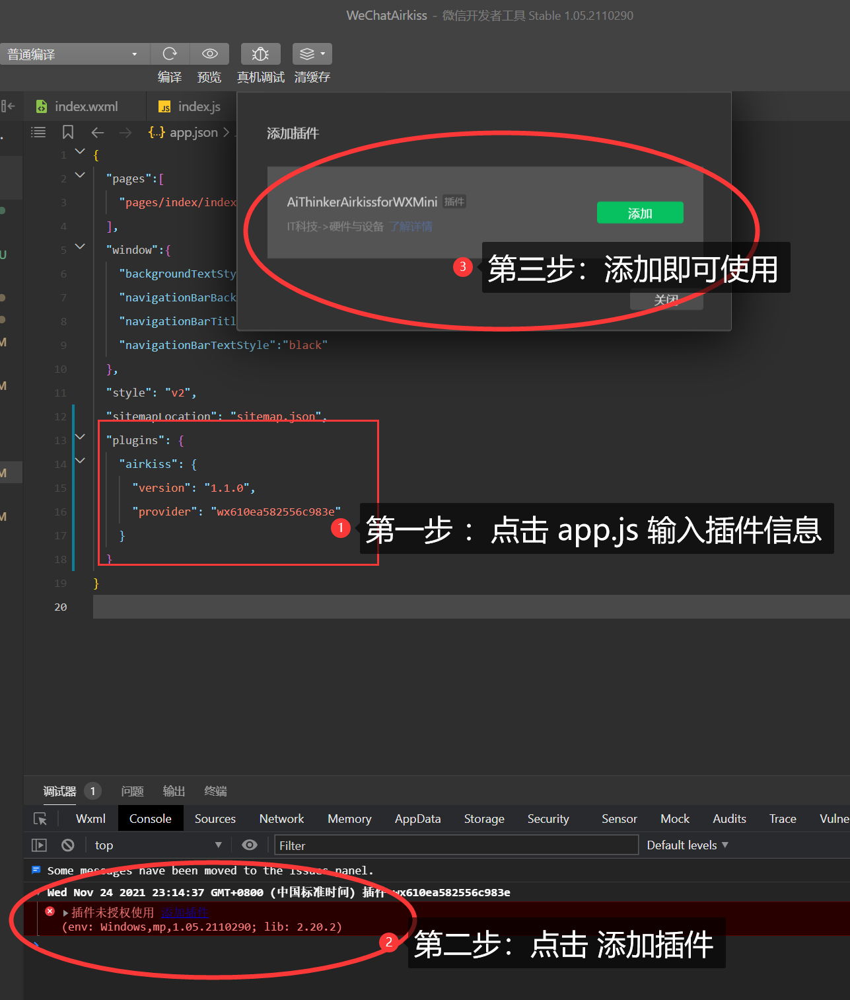

<p align="center">
  
</p>


<div align="center">
    <span>AiThinkerAirkissforWXMini, just an wechat component library!</span><br/>
    <strong>一个实现airkiss一键配的微信小程序</strong>
</div>

<br>

<div align="center">
    <a href="https://www.ai-thinker.com">
        
    </a>
    <a href="https://www.ai-thinker.com">
        
    </a>
    <a>
        
    </a>
</div>


## 维护日志，版本修订；

|修改时间|更新日志|
|----|----|
|2021.11.24|首次发布|


## 一、关于 WeChatAirkiss

本开源工程由半颗心脏基于微信配网airkiss协议做的一个开源微信配网小程序，适合于安信可在售的众多款Wi-Fi模组，包括 ESP32C3\ESP8266\ESP32\ESP32S2系列的模组。

如果您需要对应支持airkiss配网协议的无线模组，请到安信可淘宝店购买：[点击访问](https://mp.weixin.qq.com/wxopen/plugindevdoc?appid=wx610ea582556c983e&token=1116556150&lang=zh_CN)

## 二、airkiss 简介

AirKiss是微信硬件平台为Wi-Fi设备提供的微信配网、局域网发现和局域网通讯的技术。开发者若要实现通过微信客户端对Wi-Fi设备配网、通过微信客户端在局域网发现Wi-Fi设备，或者把微信客户端内的音乐、图片、文件等消息通过局域网发送至Wi-Fi设备。

设备进入 Wi-Fi 混杂模式（promiscuous mode）以监听捕获周围的 Wi-Fi 报文。由于设备暂未联网，且 Wi-Fi 网络的数据帧已通过加密，设备无法获取 payload 的内容，但可以获取报文的某些特征数据，例如每个报文的长度，同时对于某些数据帧；例如 UDP 的广播包或多播包，其报文的帧头结构比较固定，较容易识别。

此时在手机 App 或者小程序侧，即可通过发送 UDP 的广播包或多播包，并利用报文的特征，例如长度变化进行编码。

将目标 Wi-Fi 路由器的 SSID/PSW 字符以约定的编码方式发送出去，设备端在捕获到 UDP 报文后，按约定的方式进行解码，即可得到目标 Wi-Fi 路由器的相关信息并进行联网。

更多关于关于微信airkiss说明，请查阅官网文档：[点击我访问](https://iot.weixin.qq.com/wiki/new/index.html?page=4-1-1)

## 三、开始使用
自行注册一个微信小程序，请下载最新版的微信开发者工具。

新建项目之后，打开 ```app.js``` 文件添加下面代码：

```
  "plugins": {
    "airkiss": {
      "version": "1.1.0",
      "provider": "wx610ea582556c983e"
    }
  }
```

然后，会有提示是否添加插件，按照下面提示添加插件使用。


<p align="center">
  
</p>


下面举例说明了如何使用，更多使用技巧和方法参考本小程序。

```javascript
const airkiss = requirePlugin('hello-plugin');

//获取版本
console.log( airkiss.version)

//这里最好加微信小程序判断账号密码是否为空，以及其长度和是否为5G频段
airkiss.startAirkiss(this.data.ssid, this.data.password, function (res) {
           switch (res.code) {
               case 0:
                    wx.showModal({
                        title: '初始化失败',
                        content: res.result,
                        showCancel: false,
                        confirmText: '收到',
                    })
                   break;
               case 1:
                   wx.showModal({
                        title: '配网成功',
                        content: '设备IP：' + res.ip + '\r\n 设备Mac：' + res.bssid,
                        showCancel: false,
                        confirmText: '好的',
                    })
                    break;
               case 2:
                   wx.showModal({
                        title: '配网失败',
                        content: '请检查密码是否正确',
                        showCancel: false,
                        confirmText: '收到',
                    })
                   break;

               default:
                   break;
            }

})


//停止配网，建议在页面 unload 等生命周期里面调用，释放线程
airkiss.stopAirkiss()	
```
---------------------------------------
## 四、API说明

```airkiss.startAirkiss(ssid,password,funtion())```
开始配置，需要入参路由器的SSID、密码以及回调函数，出参说明见示例。

Note：请自行处理是否为2.4G频段路由器，以及密码是否正确。

```airkiss.stopAirkiss()```
停止配置，释放配网线程的内存。

Note：建议在建议在页面 unload 等生命周期里面调用。

```airkiss.version```
获取版本

-----------

## 五、FAQ

> Q1: 看样子是加载一个配网插件，这个插件开源吗？

Answer：考虑到部分版权问题，我把此做成了小程序插件，暂不开源，如需了解此插件更多使用资料，请到安信可小程序配网插件详情页：[点击访问](https://mp.weixin.qq.com/wxopen/plugindevdoc?appid=wx610ea582556c983e)

> Q2: 这个配网插件是微信官方适配的吗？可商业吗？

Answer：不是微信官方适配的，是本人适配的，现已上架小程序插件， 可商业用途。

-----------------------

## 六、本人开源微信物联网控制一览表

| 开源项目                                                     | 地址                                                         | 开源时间 |
| ------------------------------------------------------------ | ------------------------------------------------------------ | -------- |
| 微信小程序连接mqtt服务器，控制esp8266智能硬件                | https://github.com/xuhongv/WeChatMiniEsp8266                 | 2018.11  |
| 微信公众号airkiss配网以及近场发现在esp8266 rtos3.1 的实现    | https://github.com/xuhongv/xLibEsp8266Rtos3.1AirKiss         | 2019.3   |
| 微信公众号airkiss配网以及近场发现在esp32 esp-idf 的实现      | https://github.com/xuhongv/xLibEsp32IdfAirKiss               | 2019.9   |
| 微信小程序控制esp8266实现七彩效果项目源码                    | https://github.com/xuhongv/WCMiniColorSetForEsp8266          | 2019.9   |
| 一个基于安信可Ca-01的微信小程序定位追踪显示工程              | https://github.com/xuhongv/Cat.1TracerWcMini                 | 2019.9   |
| 微信小程序蓝牙配网blufi实现在esp32源码                       | https://github.com/xuhongv/BlufiEsp32WeChat                  | 2019.11  |
| 微信小程序蓝牙ble控制esp32七彩灯效果                         | https://blog.csdn.net/xh870189248/article/details/101849759  | 2019.10  |
| 可商用的事件分发的微信小程序mqtt断线重连框架                 | https://blog.csdn.net/xh870189248/article/details/88718302   | 2019.2   |
| 微信小程序以 websocket 连接阿里云IOT物联网平台mqtt服务器     | https://blog.csdn.net/xh870189248/article/details/91490697   | 2019.6   |
| 微信公众号网页实现连接mqtt服务器                             | https://blog.csdn.net/xh870189248/article/details/100738444  | 2019.9   |
| 微信小程序 AP 配网安信可 Wi-Fi 模块入网示例                  | https://github.com/Ai-Thinker-Open/Ai-Thinker-Open_WeChatMiniAP2Net | 2020.5   |
| 安信可IoT微信小程序全面开源，小程序上实现一键配网+控制+绑定  | https://blog.csdn.net/xh870189248/article/details/107140464  | 2020.8   |
| 微信小程序蓝牙+WiFi控制安信可ESP32-S/C3S模块应用             | https://github.com/xuhongv/ESP32WiFiBleControlProject        | 2021.6   |
| 安信可ESP32-S模组适配腾讯物联开发平台llsync蓝牙配网+MQTT远程控制 | https://github.com/xuhongv/qcloud-esp32-llsync-mqtt          | 2021.7   |

## 讨论交流

<table>
  <tbody>
    <tr >
      <td align="center" valign="middle" style="border-style:none">
       
        <p style="font-size:12px;">QQ群号：434878850</p>
      </td>
      <td align="center" valign="middle" style="border-style:none">
        
        <p style="font-size:12px;">本人微信公众号：徐宏blog</p>
      </td>
      <td align="center" valign="middle" style="border-style:none">
        
        <p style="font-size:12px;">私人工作微信，添加标明来意</p>
      </td>
    </tr>
  </tbody>
</table>
